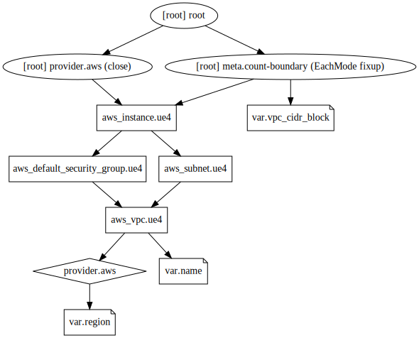

# ue4-cloud
UnrealEngine4 cloud environment ideal for fast and cheap solutions to building CI/CD tools. 

### Flow Example - CI Build HTML5 
- Given I am acting as a developer
- When I push a commit to develop branch
- Then a github action triggers a ue4 cloud build, using terraform
- And this ue4 cloud compiles the HTML5 build
- And it stores the build to an s3 bucket
- And then the github action destroys the aws resources

### Infrastructure
```
terraform graph | dot -Tsvg > graph.svg
```


### WIP Usage
```
terraform init
terraform apply

terraform destroy

# TODO: pass commit hash to terraform? wait for build? 
# TODO: use s3 bucket event to apply terraform? 
# TODO: destroy build if it taking longer than 10 minutes? 
```
